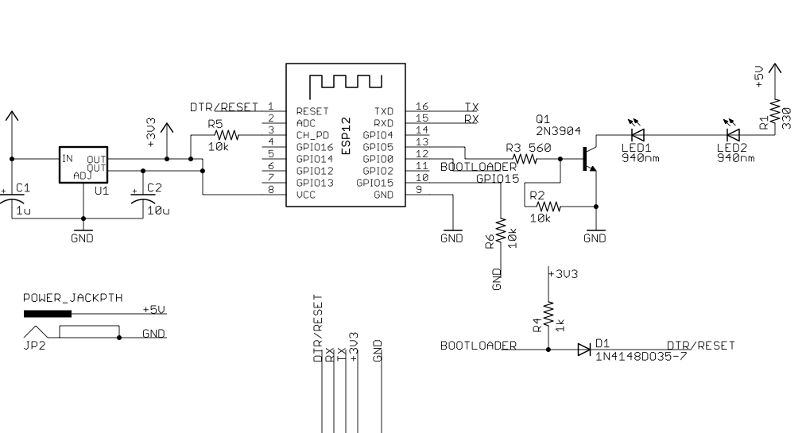

ESP8266 IR Throwie
==================

This takes the concept of the TV-B-Gone one step further
by allowing the device to be controlled with Wifi.

This version hardcodes the wifi parameters, but a future version
will allow use as an Access Point to set up wifi.

You'll need [my fork](https://github.com/rmd6502/IRremoteESP8266) of the IRRemote ESP8266 
library for the Dyson remote protocol support.

